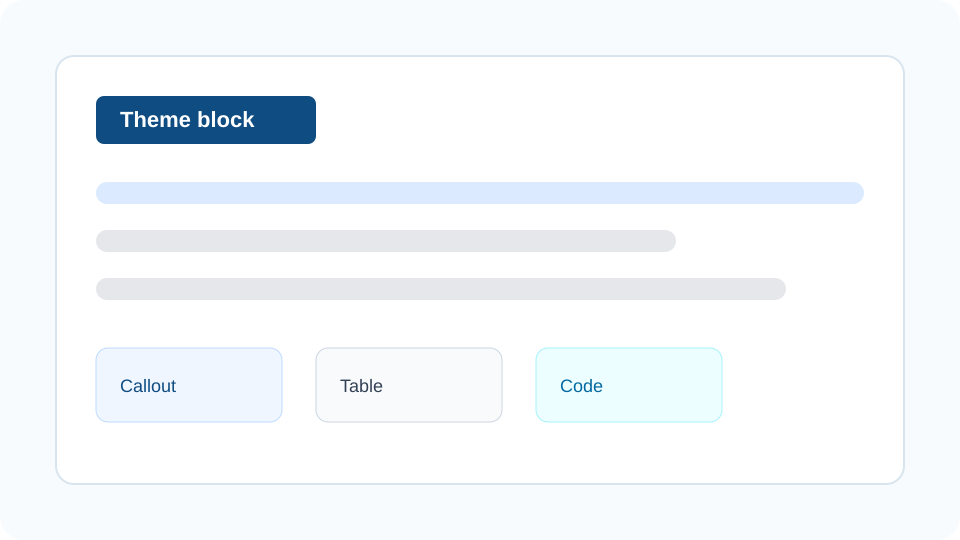

这段正文用于观察普通段落的字距、行高、段前段后间距。一个好的公众号主题，应该让读者在手机上扫读时不费力，也不应该让每一段都像被装进卡片里。

**让多个 AI 智能体分别扮演不同角色，互相对话、推理、撒谎，自己跑完一整局剧本杀。** 这类长句用于观察绿色重点和黄色荧光线能不能跨行保持稳定。这里还有一个短词高亮：==不用排队的==，一段 `inline code`，以及一个普通链接：[OpenAI](https://openai.com)。

中英混排长句用于观察换行：用 Claude Code 跑 speckit implement 时，Context Engineering 比 Prompt Engineering 更决定结果，MultiAgentOrchestrationFrameworkBenchmark 这类超长英文词也不能撑破手机宽度。长链接示例：https://github.com/zhangjian94cn/zhangjian-skills/tree/main/skills/my/content-creation/wechat-writing/theme[^1]。

> 这是普通引用块。它不属于特殊 callout，主要用于观察边线、背景色、留白和正文之间的层级关系。

[[wechat-component:part-nav]]

## AI剧本杀｜SCRIPT · 多智能体跑出来的故事素材

二级标题决定文章骨架。主题需要让读者一眼看到新章节，但不能像海报标题一样抢走正文注意力。

### MV得有故事，故事从哪来？

三级标题常用于承接一个局部判断。它应该像参考图里的黑色小标题一样清楚，并用黄色短线托住标题重心。

#### 接入 Seedance 2.0，能直接做MV了

四级标题用于观察浅绿胶囊标题。整套系统很完整，有数字人虚拟模特、有创意脚本、有分镜故事板，从策划到成片一条流水线走完。

#### STEP 01｜角色创建

Tunee 可以创建“数字人模特”。上传形象、填角色信息，重点是 ==能绑定一个专属声线==，支持克隆、上传，或根据语言 AI 生成。

##### 重点

现在通过 Tunee 调用 Seedance 2.0 生成视频，==不用排队的==，随时能跑。

## Callout 对比｜NOTE · 信息块和金句框

> [!NOTE]
> 这是 NOTE。用于补充背景、解释术语，视觉上应该轻，不要像警告一样重。

> [!IMPORTANT]
> 这是 IMPORTANT。用于承载核心判断，应该足够醒目，但不能破坏正文节奏。

> [!WARNING]
> 这是 WARNING。用于提示风险、限制条件和需要人工确认的地方。

> [!TIP]
> 这是 TIP。用于给出可执行建议，颜色和语气应当比 WARNING 更轻。

> [!金句]
> 歌是AI写的，画面是AI生成的，剧本是AI写的
>
> 下面说说怎么做的

> [!要点]
> - 先看标题层级是否清楚。
> - 再看正文是否舒服。
> - 最后看 callout、列表、代码、表格是否都稳定。

## 语义组件｜SEMANTIC · 行动、提示词与写法对照

> [!行动]
> 1. 先用标准样张打开对比页，挑出两三套候选主题。
> 2. 再用「我的文章」模式看真实稿件在手机宽度下的效果。
> 3. 选定后在 Stage 6 验收，发布时不再重复说明主题。

> [!提示词]
> 请把下面这段会议记录整理成三条行动项，每条不超过 30 个字，按优先级从高到低排列，并标出负责人。

```diff
- 这个功能非常非常重要，大家一定要重视起来。
+ 这个功能决定首月留存，本周五前完成灰度。
  保留原句里的截止时间与负责人。
```

> [!CITE]
> 1. LangChain, *Context Engineering*, blog.langchain.com/context-engineering/
> 2. Cognition, *Don't Build Multi-Agents*, cognition.ai/blog/dont-build-multi-agents
> 3. Anthropic, *How we built a multi-agent research system*, anthropic.com/engineering/built-multi-agent-research-system
> 4. Drew Breunig, *How Long Contexts Fail*, dbreunig.com
> 5. Andrej Karpathy, X/Twitter post on Context Engineering, 2025

## 列表与任务清单｜CHECKLIST · 发布前观察项

普通无序列表：

- 段落密度是否合适
- 列表圆点是否太抢眼
- 多行列表项换行后是否容易读

普通有序列表：

1. 先确认主题注册和预览能生成。
2. 再确认最终 HTML 已经内联样式。
3. 最后用 Stage 7 dry-run 或草稿箱回读验收。

任务清单：

- [ ] 待确认：摘要卡在手机上是否太像大灰框
- [x] 已完成：callout 不再保留原始标记
- [x] 已完成：task list 不输出 `<input type="checkbox">`

## 代码块｜CODE · 深色块是否割裂

行内命令示例：`npx -y bun theme-registry.ts validate`。

```ts
type ThemeCheck = {
  name: string;
  hasInlineStyle: boolean;
  hasRawMarkdownAlert: boolean;
};

const result: ThemeCheck = {
  name: "moyu",
  hasInlineStyle: true,
  hasRawMarkdownAlert: false,
};
```

```bash
NO_OPEN=1 bash scripts/theme-preview.sh
```

## 表格｜TABLE · 信息密度检查

| 元素 | 应该观察什么 | 风险 |
| --- | --- | --- |
| 概述卡 | 是否像摘要，而不是大灰框 | 过重会压住正文 |
| H2 | 是否能快速定位章节 | 太大像海报 |
| Callout | 是否有稳定层级 | 太花会干扰阅读 |
| Task list | 是否像清单而不是表单 | `<input>` 可能被过滤 |
| 代码块 | 是否能横向滚动或稳定换行 | 太暗会割裂 |

## 图片与媒体占位｜MEDIA · 图片边框和视频占位



如果文章需要视频，Markdown 阶段用占位符，发布阶段再由 Stage 7 上传并替换为微信视频组件：

[[wechat-video:theme-showcase]]

---

## 写在最后｜LAST

> [!金句]
> 每个人都可以拥有自己的虚拟偶像了

给她一张脸、一个声线、一段故事，她就能唱歌、能拍 MV、能拍广告，只需要知道你想让她成为谁。

每个人都能玩点音乐，每个人都能当自己的厂牌，想想还挺有意思的。

[[wechat-component:engagement-card]]

结尾段用于观察分隔线和尾段间距。主题预览样张要覆盖足够多元素，真实文章预览则用于确认具体文章在当前主题下是否顺眼。

[^1]: 脚注用于观察文末注释区的字号与行距，长链接需要在注释里正常折行。
